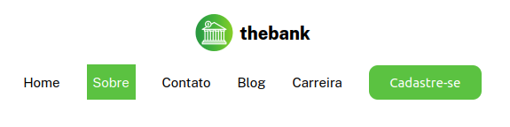
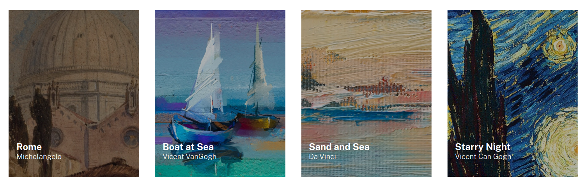

# Exercício CSS avançado - Flexbox

## Exercício 1 - Profile Card (Frontend Mentor) 
### Descrição do Desafio
*Criar página responsiva baseada em um design fornecido*

### Visualização do Projeto
[Visualizar Online 🖱](https://lucasjcfreire.github.io/challenges/frontend-mentor/01-newbie/profile-card/)

[Visualizar Repositório 📕](https://github.com/LucasJCFreire/challenges/tree/main/frontend-mentor/01-newbie/profile-card)

## Exercício 2 - Advice generator app (Frontend Mentor) 
### Descrição do Desafio
*Criar página responsiva baseada em um design fornecido*

### Visualização do Projeto
[Visualizar Online 🖱](https://lucasjcfreire.github.io/challenges/frontend-mentor/02-junior/advice-generator/)

[Visualizar Repositório 📕](https://github.com/LucasJCFreire/challenges/tree/main/frontend-mentor/02-junior/advice-generator)

## Exercício 3 - Menu com flexbox 
### Descrição do Desafio
*Criar página responsiva baseada em um design fornecido*

### Visualização do Projeto
[Visualizar Online 🖱](https://lucasjcfreire.github.io/challenges/dev-quest/exercicios-css-avancado-flexbox/03-menu-flexbox)

[Visualizar Repositório 📕](https://github.com/LucasJCFreire/challenges/tree/main/dev-quest/exercicios-css-avancado-flexbox/03-menu-flexbox)

## Exercício 4 - Lista de imagens 
### Descrição do Desafio
*Criar página responsiva baseada em um design fornecido*

### Visualização do Projeto
[Visualizar Online 🖱](https://lucasjcfreire.github.io/challenges/dev-quest/exercicios-css-avancado-flexbox/04-lista-imagens)

[Visualizar Repositório 📕](https://github.com/LucasJCFreire/challenges/tree/main/dev-quest/exercicios-css-avancado-flexbox/04-lista-imagens)

