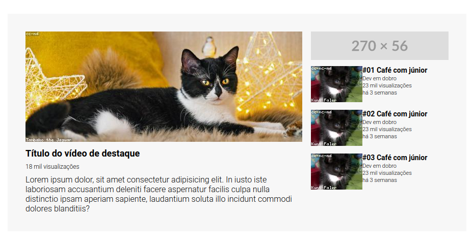

# Exercício CSS avançado - Grid

## Layout do youtube com grid
### Descrição do Desafio
*Criar do youtube responsivo baseada em um design figma fornecido*

### Visualização do Projeto
[Visualizar Online 🖱](https://lucasjcfreire.github.io/challenges/dev-quest/exercicios-css-avancado-grid)

[Visualizar Repositório 📕](https://github.com/LucasJCFreire/challenges/tree/main/dev-quest/exercicios-css-avancado-grid)

