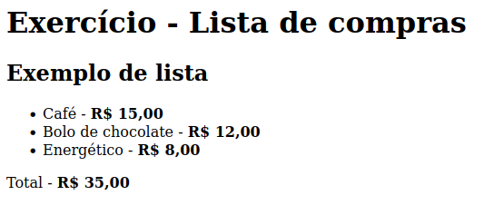
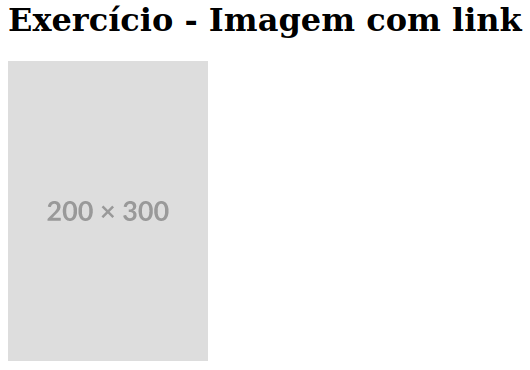
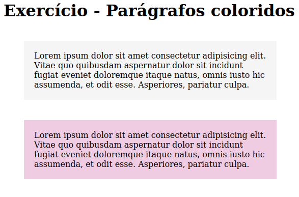
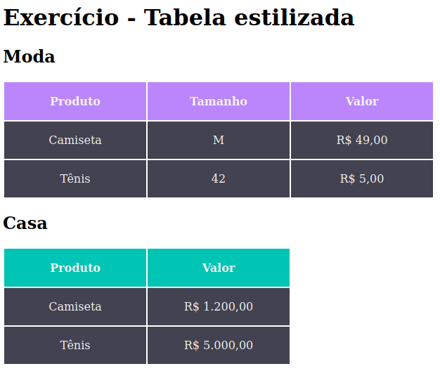

# Exercício HTML e CSS básico

## Exercício 1 - Lista de compras
### Descrição do Desafio
*Criar uma lista de alimentos "saudáveis" usando as tags corretas de HTML.*

- #### Requisitos
    - *Conter no mínimo 3 itens com nome e preço.*
    - *Conter valor total.*
    - *Ênfase no valor dos produtos e no total.*

### Visualização do Projeto
[Visualizar Online 🖱](https://lucasjcfreire.github.io/challenges/dev-quest/exercicios-html-css-basico/01-lista-de-compras)

[Visualizar Repositório 📕](https://github.com/LucasJCFreire/challenges/tree/main/dev-quest/exercicios-html-css-basico/01-lista-de-compras)

___
## Exercício 2 - Imagem com link
### Descrição do Desafio
*Criar uma uma imagem com link externo.*

- #### Requisitos
    - *Âncora com link externo para o site do google.*
    - *Deve abrir em uma nova aba.*
    - *Tamanho da imagem deve ser 200x300 pixels.*

### Visualização do Projeto
[Visualizar Online 🖱](https://lucasjcfreire.github.io/challenges/dev-quest/exercicios-html-css-basico/02-imagem-com-link)

[Visualizar Repositório 📕](https://github.com/LucasJCFreire/challenges/tree/main/dev-quest/exercicios-html-css-basico/02-imagem-com-link)

___
## Exercício 3 - Parágrafos coloridos
### Descrição do Desafio
*Criar dois parágrafos estilizados*

- #### Requisitos
    - *Parágrafo padrão com cor de fundo #F5F5F5 e parágrafo destacado com cor de fundo #F0CCE2.*
    - *Espaçamento entre parágrafos de 40px.*
    - *Espaçamento interno de 20px.*
    - *Aplicar estilização de forma que facilite a manutenção e inserção de novos parágrafos futuramente.*

### Visualização do Projeto
[Visualizar Online 🖱](https://lucasjcfreire.github.io/challenges/dev-quest/exercicios-html-css-basico/03-paragrafos-coloridos)

[Visualizar Repositório 📕](https://github.com/LucasJCFreire/challenges/tree/main/dev-quest/exercicios-html-css-basico/03-paragrafos-coloridos)

___
## Exercício 4 - Tabela estilizada
### Descrição do Desafio
*Criar tabelas moda e casa estilizadas*

- #### Requisitos
    - *Criar tabela de moda com cabeçalho produto, tamanho e valor*
    - *Cor de fundo do cabeçalho moda - #BB86FC*
    - *Cria tabela de casa com cabeçalho produto e valor*
    - *Cor de fundo do cabeçalho casa - #00C4B4*
    - *Cor de fundo dos valores da tabela - #424250*

### Visualização do Projeto
[Visualizar Online 🖱](https://lucasjcfreire.github.io/challenges/dev-quest/exercicios-html-css-basico/04-tabela-estilizada)

[Visualizar Repositório 📕](https://github.com/LucasJCFreire/challenges/tree/main/dev-quest/exercicios-html-css-basico/04-tabela-estilizada)

