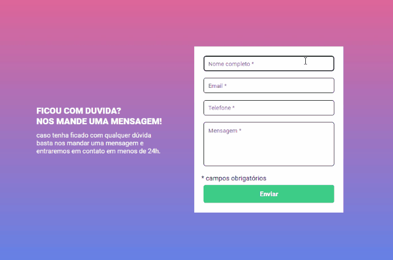

# Formulário com validação - Exercício de HTML, CSS e JS
Este projeto é um exercício proposto pelo curso de Desenvolvimento web full stack "Dev Quest".

## Descrição e funcionalidades
Elaboração de formulário em página da web utilizando HTML e CSS com validação dos campos preenchidos ao clicar no botão "enviar" utilizando JavaScript.

## O que aprendi
Durante o desenvolvimento deste projeto, pude reforçar e colocar em prática os seguintes conhecimentos:

## HTML
- Manipulação de formulários e entrada de dados do usuário.
- Utilização de classes semânticas para melhorar a acessibilidade e estrutura do documento.

## CSS
- Utilização de seletores para estilizar diferentes elementos.
- Implementação de layouts responsivos utilizando media queries.
- Implementação de classes com efeito de "destaque" para melhorar a experiência do usuário.

## JavaScript
- Manipulação do DOM para interagir dinamicamente com os elementos da página.
- Uso de eventos para responder às ações do usuário.
- Implementação de lógicas e condicionais para o funcionamento correto da aplicação.

## Git GitHub
- Versionamento de código utilizando GitBash.
- Publicação do projeto no GitHub, reforlando conhecimentos sobre commits, branches para controle de versão.

## Boas práticas de desenvolvimento
- Organização do código em arquivos separados para melhor legibilidade e manutenção.
- Testes locais para garantir o funcionamento adequado das funcionalidades implementadas.
