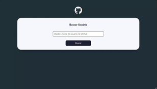

# Search Git Hub

## Descrição do Desafio
Este é um desafio do curso dev quest com o objetivo de criar um página de consulta de usuários do github, utilizando uma API.

## Linguagens Utilizadas
- HTML
- CSS
- JS

## Tecnologias e Técnicas Utilizadas
- Responsividade com Media Queries
- Flexbox para layout
- CSS Variables para reutilização e gerenciamento de cores e valores

## Visualização do Projeto
[Visualizar Online 🖱](https://lucasjcfreire.github.io/challenges/dev-quest/search-github-user)

