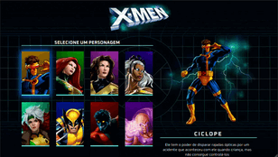

# Seleção X-men

## Descrição do Desafio
Este projeto foi criado com base nos recursos disponibilizados pelo curso de Desenvolvedor Web Full Stack Dev Quest. Consiste em uma seleção interativa de personagens do X-Men, que ao clicar em cada personagem são apresentadas suas habilidades, simulando um jogo. 

## Linguagens Utilizadas
- HTML
- CSS
- JS

## Tecnologias e Técnicas Utilizadas
- Responsividade com Media Queries
- Flexbox para layout
- CSS Variables para reutilização e gerenciamento de cores e valores

## Visualização do Projeto
[Visualizar Online 🖱](https://lucasjcfreire.github.io/challenges/dev-quest/selecao-xmen)

