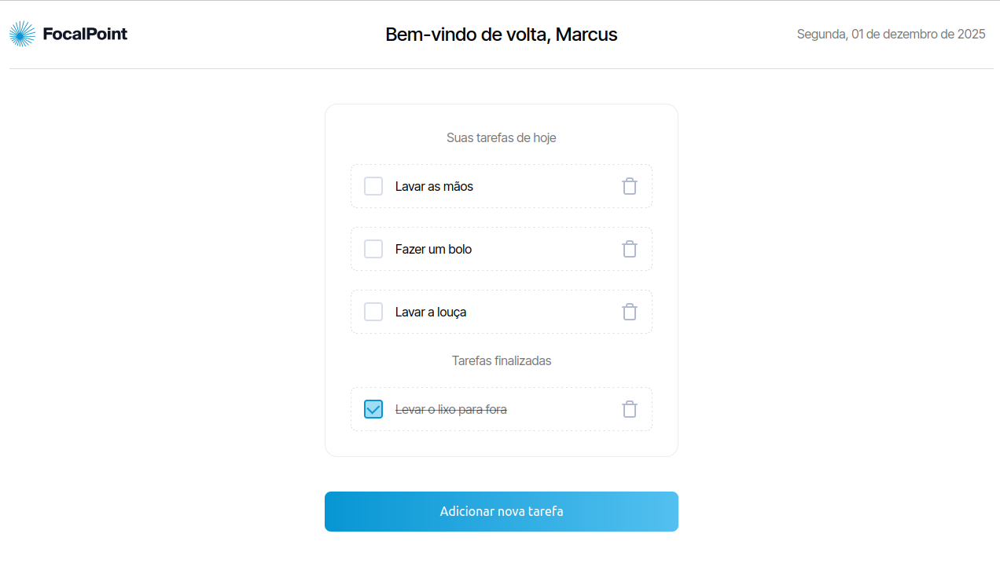

# Focal Point

<table>
    <tr>
        <th colspan="2">
            <a href="https://focalpointchallenge.vercel.app/" title="Clique para acessar o deploy">
                
                
Clique para acessar o deploy!

            </a>
        </th>
    </tr>
    <tr>
        <th style="width: 50%;">
             
            English
        </th>
        <th style="width: 50%;">
             
            Portuguese
        </th>
    </tr>
    <tr>
        <th>
About the Project
</th>
        <th>
Sobre o Projeto
</th>
    </tr>
    <tr>
        <td>
            
The objective of this challenge was to develop a to-do list using Next.js, App Router, and Sass, carefully following a design created in Figma. In addition to meeting the proposed requirements, I aimed to enhance the application with accessibility features, such as ARIA attributes and the focusTrap library in the Modal, ensuring a more inclusive user experience without compromising the design's aesthetics.

        </td>
        <td>
            
O objetivo deste desafio foi desenvolver uma lista de tarefas utilizando Next.js, App Router e Sass baseado em um design Figma. Além de atender aos requisitos propostos, busquei enriquecer a aplicação com recursos de acessibilidade, como atributos ARIA e a biblioteca focusTrap no Modal, garantindo uma experiência de uso mais inclusiva sem comprometer a estética do design.

        </td>
    </tr>
    <tr>
        <th>
Skills / Techniques
</th>
        <th>
Habilidades / Técnicas
</th>
    </tr>
    <tr>
        <th colspan="2">
            
            
            
        </th>
    </tr>
    <tr>
        <th>
Download Project
</th>
        <th>
Baixar Projeto
</th>
    </tr>
    <tr>
        <td>
            
Clone the repository without history using the command

        </td>
        <td>
            
Clone Repositório sem histórico com o comando

        </td>
    </tr>
    <tr>
        <td colspan="2">
            <code>git clone --no-checkout https://github.com/LucasJCFreire/challenges.git</code>
        </td>
    </tr>
    <tr>
        <td>
Navigate to the repository folder
</td>
        <td>
Navegue até a pasta do repositório
</td>
    </tr>
    <tr>
        <td colspan="2">
            <code>cd challenges</code>
        </td>
    </tr>
    <tr>
        <td>
Enable sparse-checkout
</td>
        <td>
Habilite o sparse-checkout
</td>
    </tr>
    <tr>
        <td colspan="2">
            <code>git sparse-checkout init --cone</code>
        </td>
    </tr>
    <tr>
        <td>
Add the focalpoint folder
</td>
        <td>
Adicione a pasta focalpoint
</td>
    </tr>
    <tr>
        <td colspan="2">
            <code>git sparse-checkout set focalpoint</code>
        </td>
    </tr>
    <tr>
        <td>
Checkout the branch
</td>
        <td>
Faça o checkout da branch
</td>
    </tr>
    <tr>
        <td colspan="2">
            <code>git checkout main</code>
        </td>
    </tr>
    <tr>
        <th>
Comments and Feedback
</th>
        <th>
Comentários e Feedback
</th>
    </tr>
    <tr>
        <td>
I am very happy with your visit. Please feel free to explore my work and contact me.
</td>
        <td>
Fico muito feliz com a sua visita. Sinta-se à vontade para explorar meu trabalho e entrar em contato comigo.
</td>
    </tr>
    <tr>
        <th colspan="2">
            
Lucas Jones - Frontend Developer

            
            
            
            
            
        </th>
    </tr>
    <tr>
        <th colspan="2">
            <a href="https://github.com/LucasJCFreire/challenges" title="Explore mais desafios clicando aqui">
                
                
Explore mais desafios clicando aqui!

            </a>
        </th>
    </tr>
</table>
