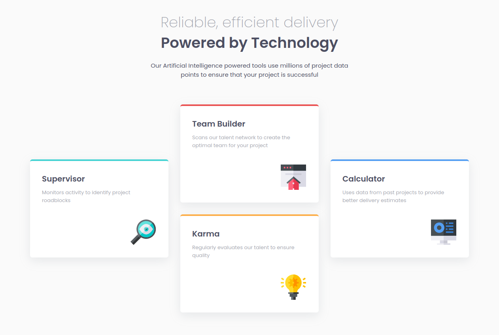

# Four card feature section master

## Descrição do Desafio
Este é um desafio do Frontend Mentor onde o objetivo é criar uma página responsiva baseada em um design fornecido.

## Linguagens Utilizadas
- HTML
- CSS

## Tecnologias e Técnicas Utilizadas
- Responsividade com Media Queries
- Flexbox para layout
- CSS Variables para reutilização e gerenciamento de cores e valores

## Visualização do Projeto
[Visualizar Online 🖱](https://lucasjcfreire.github.io/challenges/frontend-mentor/01-newbie/four-card-feature-section-master/)

[Avaliação Frontend Mentor ✅](https://www.frontendmentor.io/solutions/quality-class-names-css-variables-and-meticulous-organization-8znJHbRod-)

