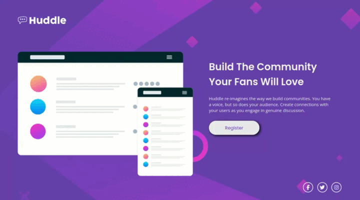

# Huddle landing page with a single introductory section

## Descrição do Desafio
Este é um desafio do Frontend Mentor onde o objetivo é criar uma página responsiva baseada em um design fornecido.

## Linguagens Utilizadas
- HTML
- CSS

## Tecnologias e Técnicas Utilizadas
- Responsividade com Media Queries
- Grid e flexbox para layout
- CSS Variables para reutilização e gerenciamento de cores e valores

## Visualização do Projeto
[Visualizar Online 🖱](https://lucasjcfreire.github.io/challenges/frontend-mentor/01-newbie/lp-huddle/)

[Avaliação Frontend Mentor ✅](https://www.frontendmentor.io/solutions/used-grid-and-flexbox-techniques-to-create-the-responsive-layout-WV8VbJ7Mix)

