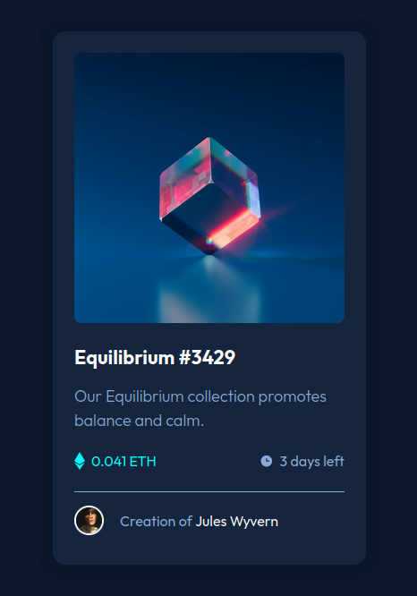

# Nft preview card component main

## Descrição do Desafio

Este é um desafio do Frontend Mentor onde o objetivo é criar uma página responsiva baseada em um design fornecido.

## Linguagens Utilizadas

- HTML
- Tailwind CSS

## Tecnologias e Técnicas Utilizadas

- Tailwind CDN
- Flexbox para layout

## Visualização do Projeto

[Visualizar Online 🖱](https://lucasjcfreire.github.io/challenges/frontend-mentor/01-newbie/nft-preview-card-component-main/)

[Avaliação Frontend Mentor ✅]()

