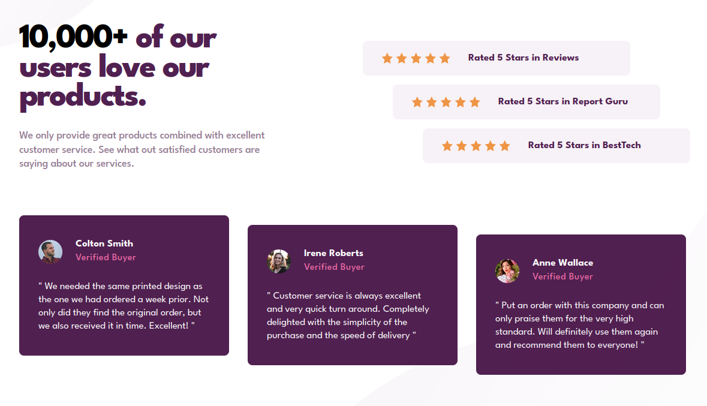

# Social proof section

## Descrição do Desafio

Este é um desafio do Frontend Mentor onde o objetivo é criar uma página responsiva baseada em um design fornecido.

## Linguagens Utilizadas

- HTML
- Sass CSS

## Tecnologias e Técnicas Utilizadas

- Sass plugin: `Live Sass compiler`
- Css minify
- Flexbox para layout

## Visualização do Projeto

[Visualizar Online 🖱](https://lucasjcfreire.github.io/challenges/frontend-mentor/01-newbie/social-proof-section-master/)

[Avaliação Frontend Mentor ✅](https://www.frontendmentor.io/solutions/practicing-sass---partials-mixins-and-variables-3f4-RW-gtR)

