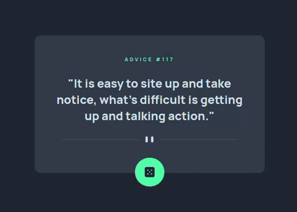

# Advice generator app

## Descrição do Desafio
Este é um desafio do Frontend Mentor onde o objetivo é criar uma página responsiva baseada em um design fornecido,
além de utilizar Advice Slip API para gerar conselhos aleatórios ao clicar no botão.

## Linguagens Utilizadas
- HTML
- CSS
- JS

## Tecnologias e Técnicas Utilizadas
- Responsividade com Media Queries
- Grid e flexbox para layout
- CSS Variables para reutilização e gerenciamento de cores e valores

## Visualização do Projeto
[Visualizar Online 🖱](https://lucasjcfreire.github.io/challenges/frontend-mentor/02-junior/advice-generator/)

[Avaliação Frontend Mentor ✅](https://www.frontendmentor.io/solutions/organization-html-css-and-javascript-9lAtYXxnGA)

