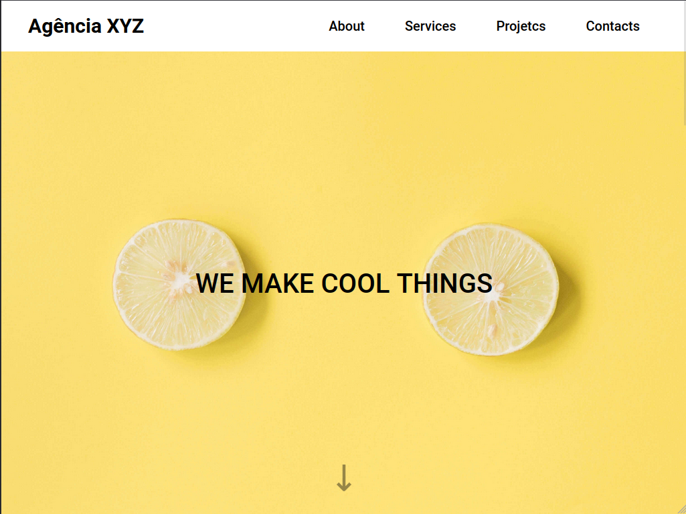

# Landing page - Agência XYZ

## Descrição do Desafio
Exercício do curso dev quest com o objetivo de criar uma landing page a partir de um 

## Linguagens Utilizadas
- HTML
- CSS
- JS

## Tecnologias e Técnicas Utilizadas
- Responsividade com Media Queries
- Grid e flexbox para layout

## Visualização do Projeto
[Visualizar Online 🖱](https://lucasjcfreire.github.io/challenges/dev-quest/landing-page-agencia-xyz)

