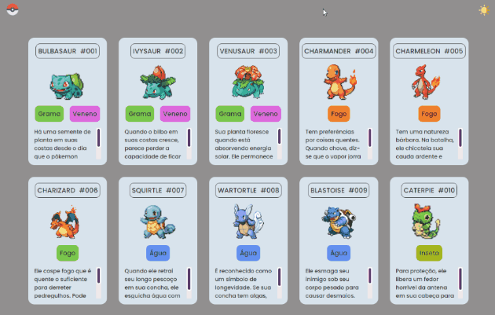

# Site - Listagem Pokemon
Este site foi criado seguindo o tutorial do canal do youtube "Dev em dobro"  
com o intuito de exercitar conceitos básicos de HTML, CSS e JS.

## Tecnologias utilizadas
- HTML
- CSS
- JS

