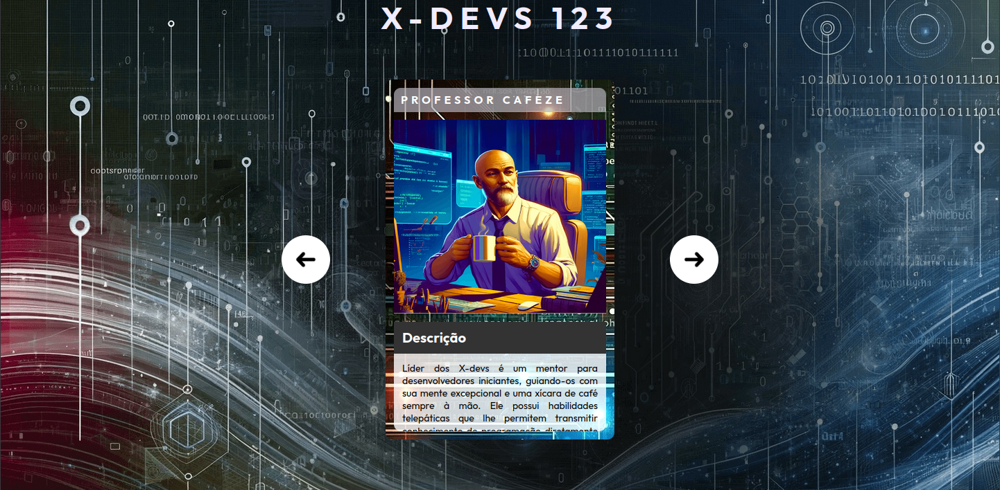

# X-Dev

<table>
    <tr>
    <th colspan="2">
    <a href="https://lucasjcfreire.github.io/challenges/dev-quest/x-devs" title="Click to access deploy">
      
      
Click to access deploy!

    </a>
    </th>
  </tr>
  <tr>
    <th style="width: 50%;">
       
      English
    </th>
    <th style="width: 50%;">
       
      Portuguese
    </th>
  </tr>
  <tr>
    <th>
About the Project
</th>
    <th>
Sobre o Projeto
</th>
  </tr>
  <tr>
    <td>
This is a project inspired by the tutorial on the Dev em Dobro channel, where a slider was developed using HTML, CSS and JavaScript. However, in this version, I chose to use HTML, Tailwind CSS and JavaScript.
</td>
    <td>
Este é um projeto inspirado no tutorial do canal Dev em Dobro, onde foi desenvolvido um slider utilizando HTML, CSS e JavaScript. No entanto, nesta versão, optei por utilizar HTML, Tailwind CSS e JavaScript.
</td>
  </tr>
  <tr>
    <th>
Skills / Techniques
</th>
    <th>
Habilidades / Técnicas
</th>
  </tr>
<tr>
  <th colspan="2">
    
    
    
    
    
    
    
  </th>
</tr>
  <tr>
    <th>
Comments and Feedback
</th>
    <th>
Comentários e Feedback
</th>
  </tr>
  <tr>
    <td>
I am very happy with your visit. Please feel free to explore my work and contact me.
</td>
    <td>
Fico muito feliz com a sua visita. Sinta-se à vontade para explorar meu trabalho e entrar em contato comigo.
</td>
  </tr>
  <tr>
    <th colspan="2">
      
Lucas Jones - Frontend Developer

      
      
      
      
      
    </th>
  </tr>
  <tr>
    <th colspan="2">
      <a href="https://github.com/LucasJCFreire/challenges" title="Explore more challenges by clicking here">
        
        
Explore more challenges by clicking here!

      </a>
    </th>
  </tr>
</table>
